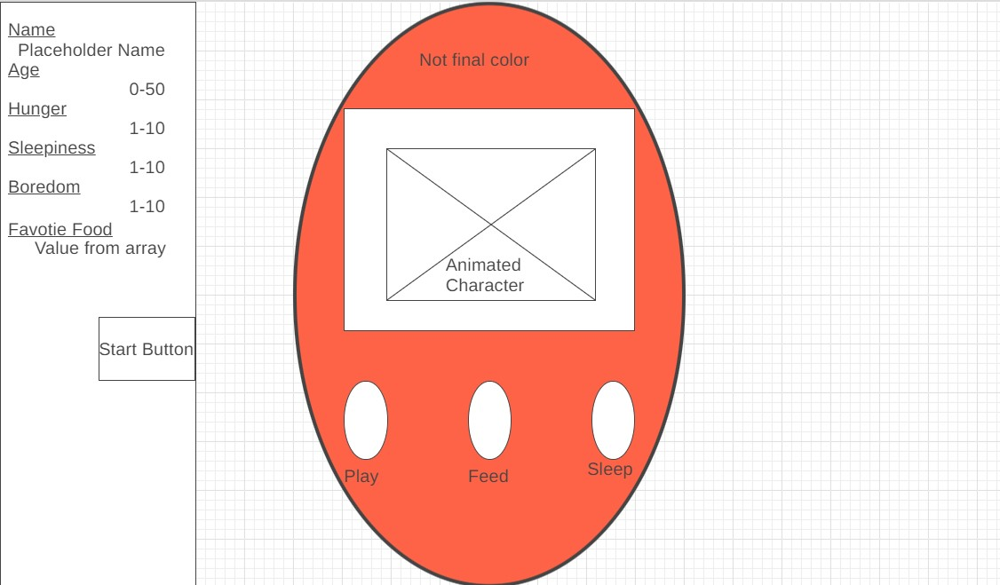

WIREFRAME

USER STORIES
1) When the start button is pressed I can name the tamagotchi and the game begins.
2) Every 20 seconds my Tamagochi ages until it reaches a maximum of 60, at which point it dies. If I was able to keep it alive up to this point an alert comes up congratulating me for winning and offering condolences for the lost pet.
3) As time goes on my Tamagochi's hunger, boredom, and tiredness worsen, but the exact time it takes varies between 2-10 seconds.
4) At age 20 and 40, my Tamagochi's animation changes to indicate ageing.
5) When I press the Feed, Sleep, or Play buttons it resets the respective counters to 0.
TECH USED

